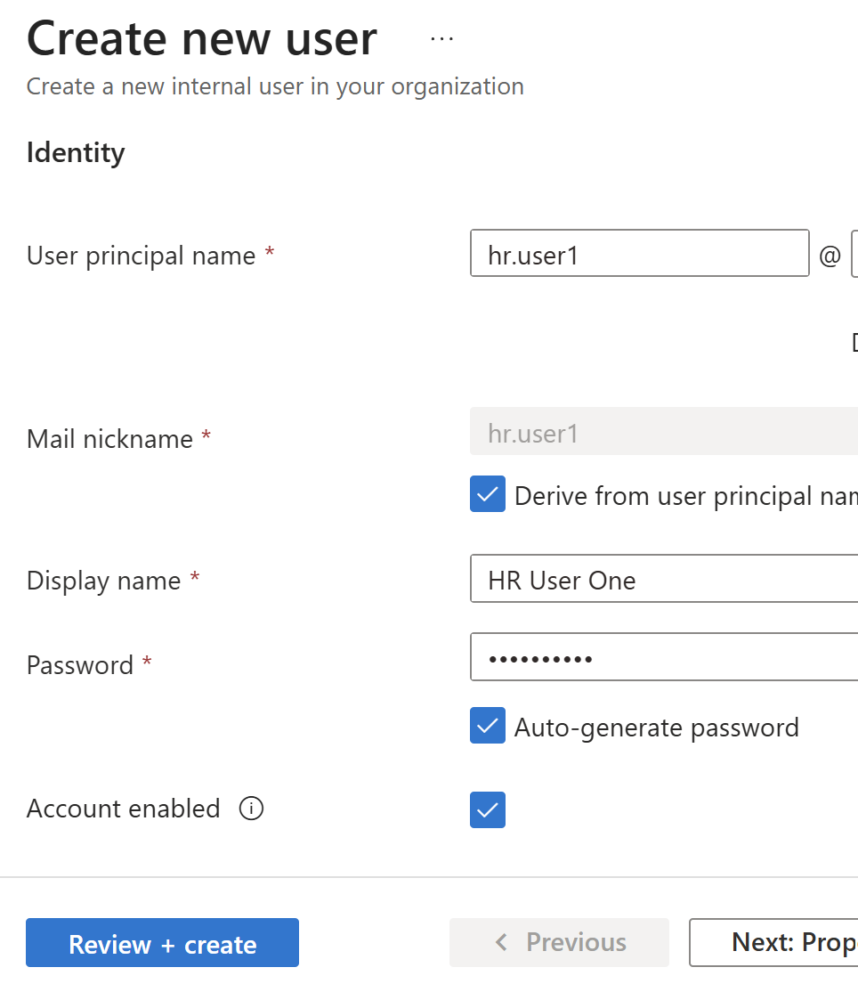
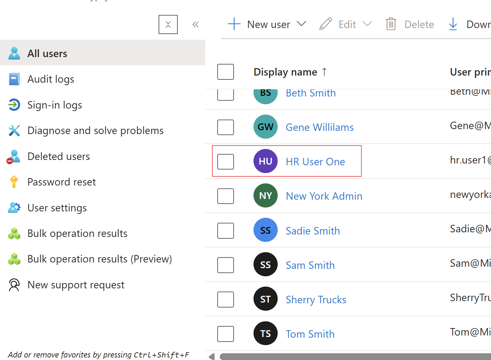
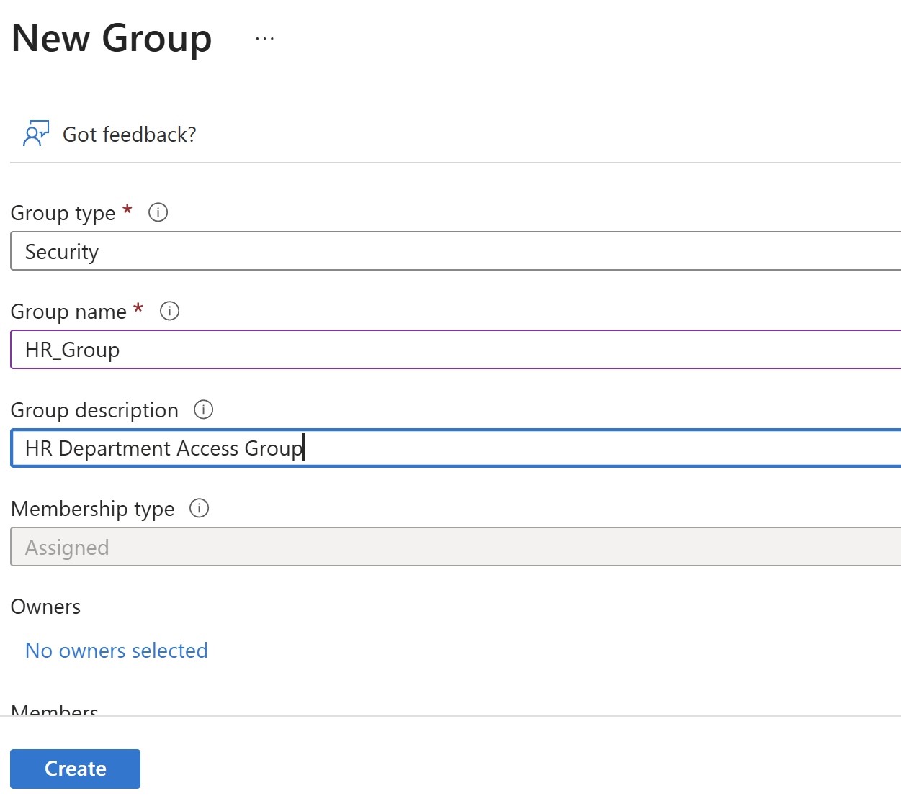
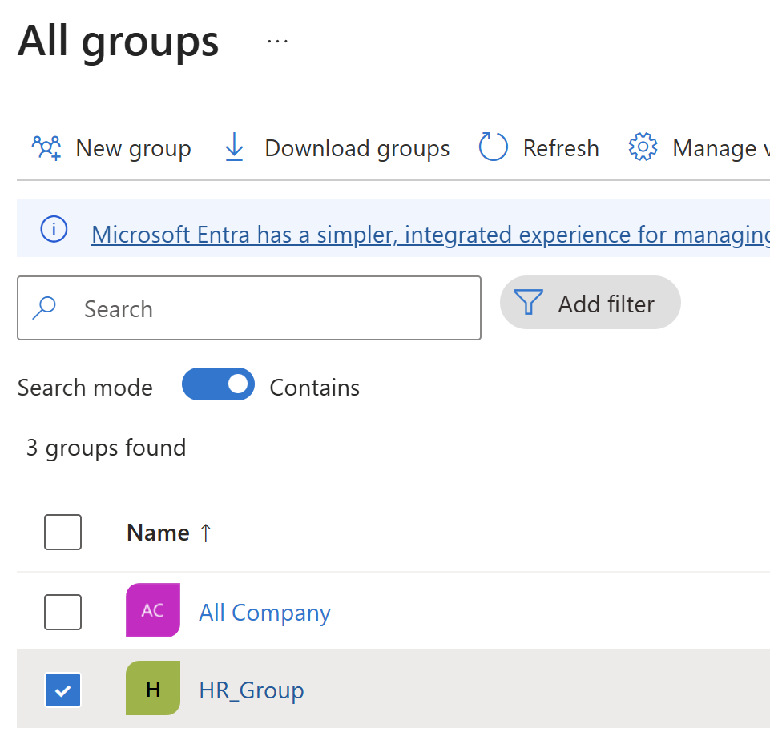
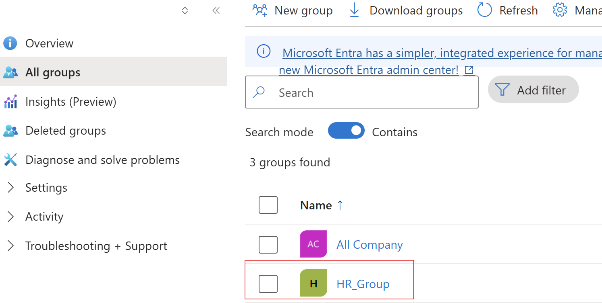
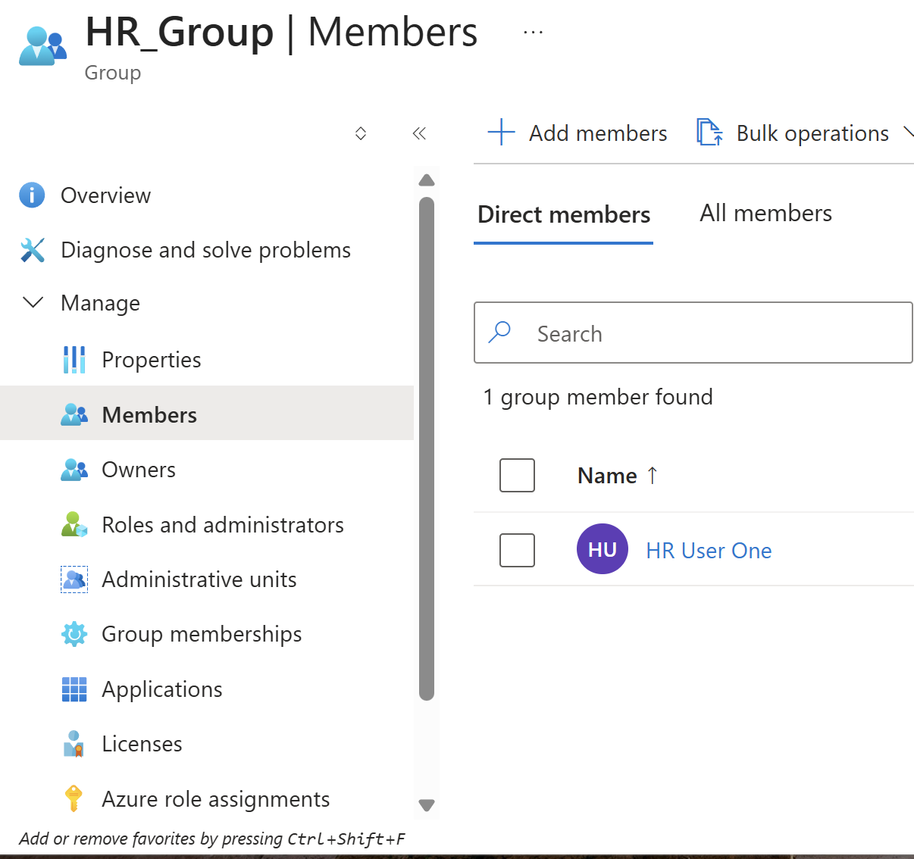

Identity Lifecycle Management Lab (Microsoft Entra ID)

## Objective
Simulate onboarding and access assignment using group-based access control.

## Implementation Details
- Created a user (HR User One)
- Created a security group (HR_Group)
- Assigned the user to the group

## Skills Demonstrated
- User provisioning
- Group management
- Role-Based Access Control (RBAC)

## Why It Matters
In real-world environments, access is assigned to groups rather than individual users. This approach improves scalability, simplifies access management, and reduces the risk of misconfigured permissions.

## Screenshots

### Step 1: Create User

### Step 2: User Created

### Step 3: Create Group

### Step 4: Group Created

### Step 5: Add User to Group

### Step 6: User Added to Group

