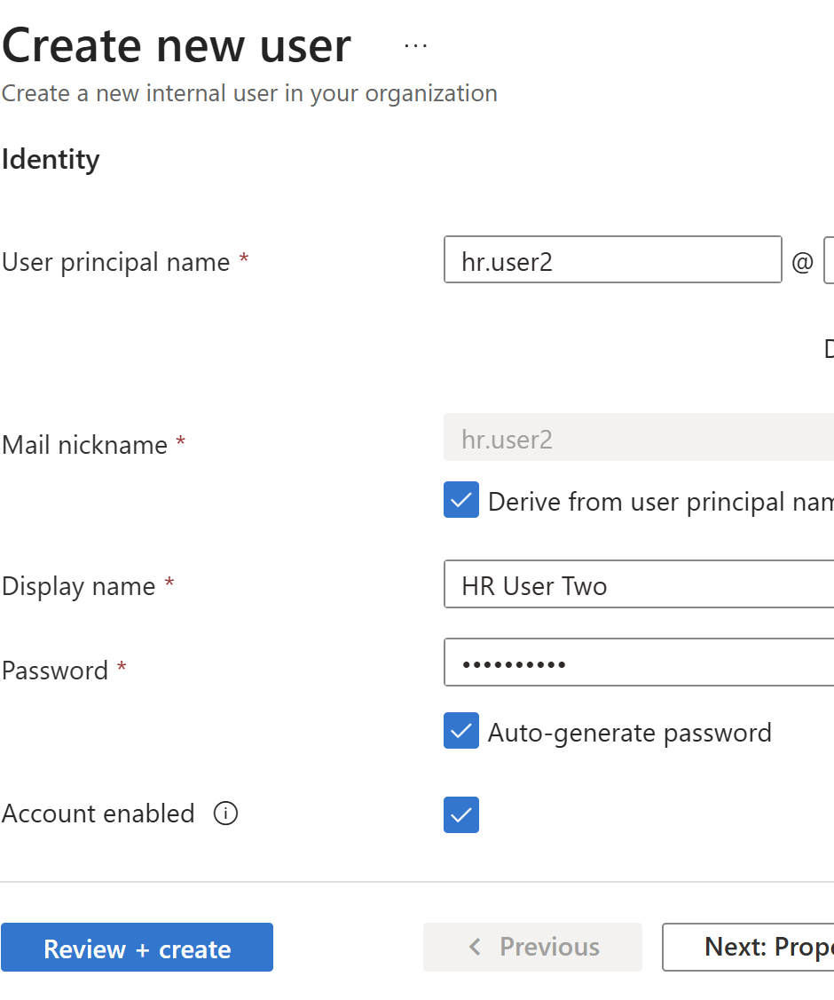
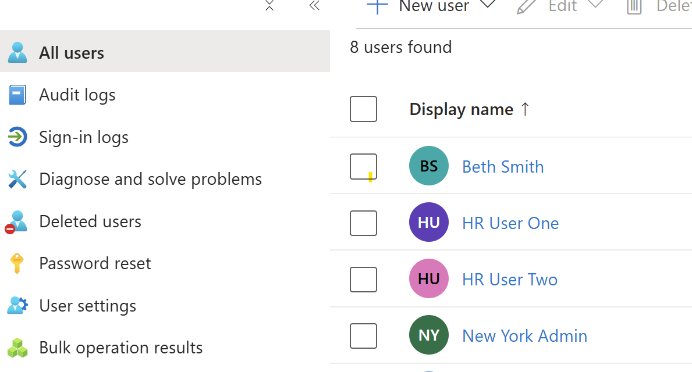
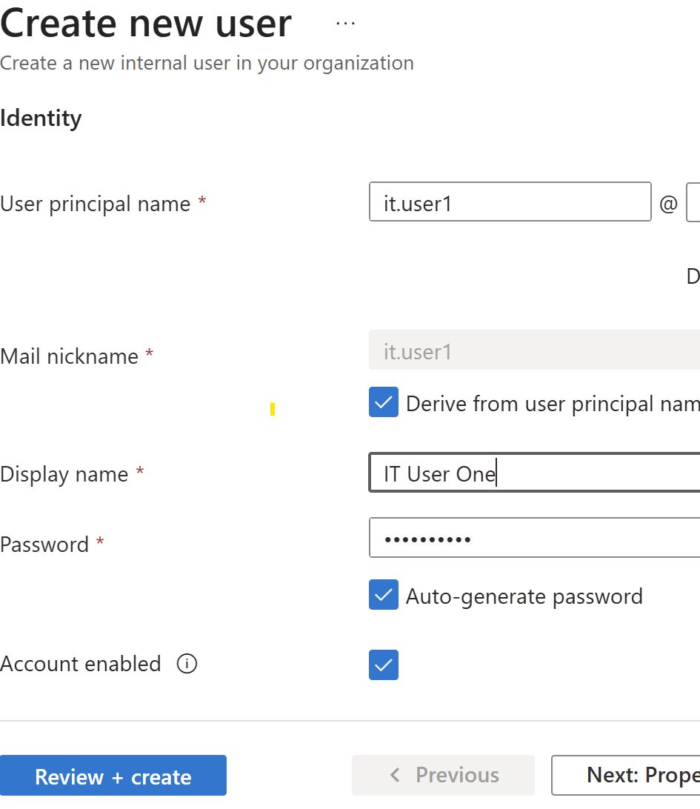
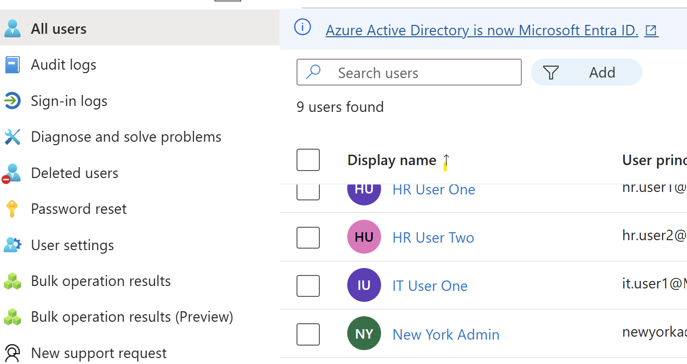
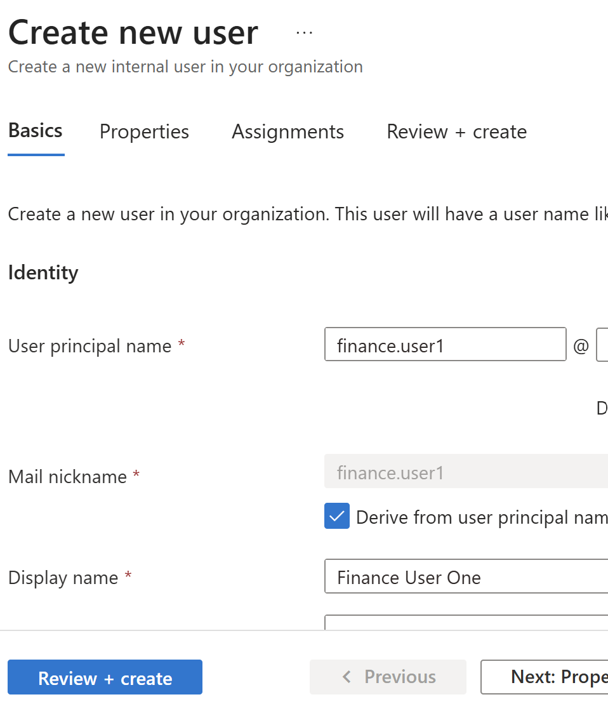
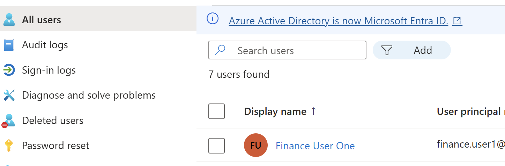
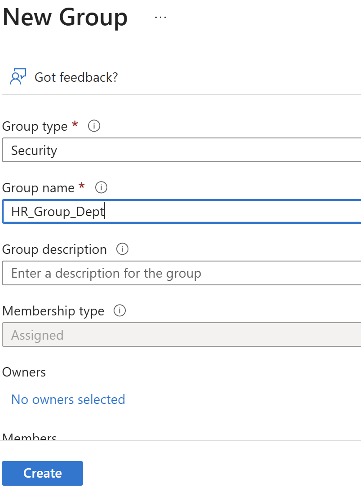
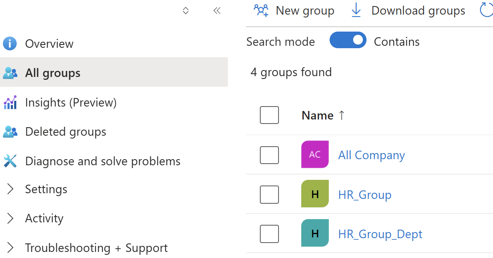

# Department-Based Access Control Lab (Microsoft Entra ID)

## Objective
Simulate access control by assigning users to department-based groups.

## Implementation Details
- Created users for HR, IT, and Finance
- Created security groups for each department
- Assigned users to their respective groups

## Skills Demonstrated
- User provisioning
- Group-based access control
- Identity and access management (IAM)

## Why It Matters
In real-world environments, access is managed through groups rather than individual users. 
This simplifies administration, improves scalability, and reduces security risks.

## Screenshots

### Create HR User

### HR User Created

### Create IT User

### IT User Created

### Create Finance User

### Finance User Created

### Create HR Group

### HR Group Created

