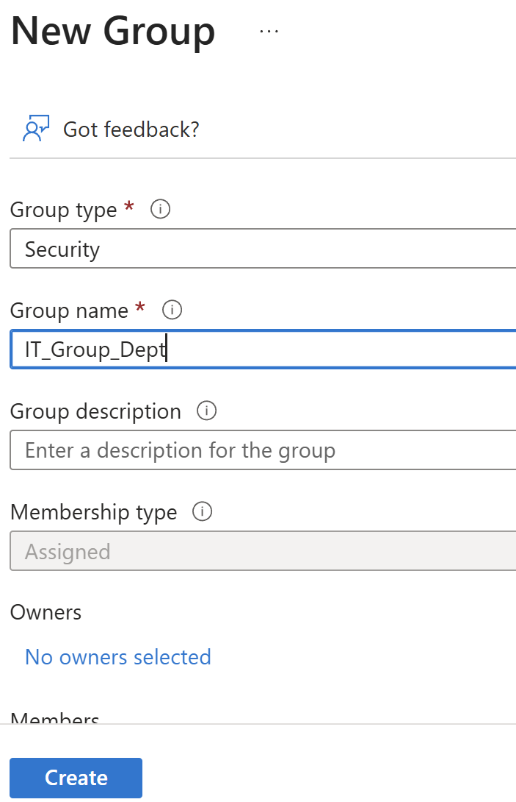
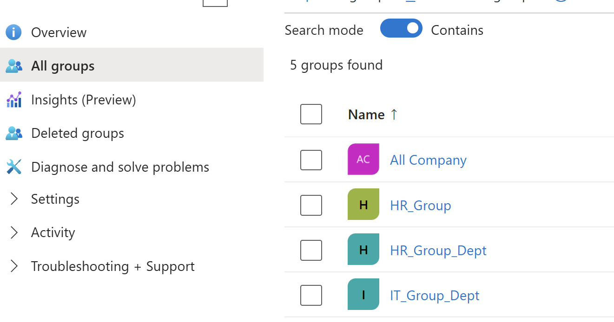
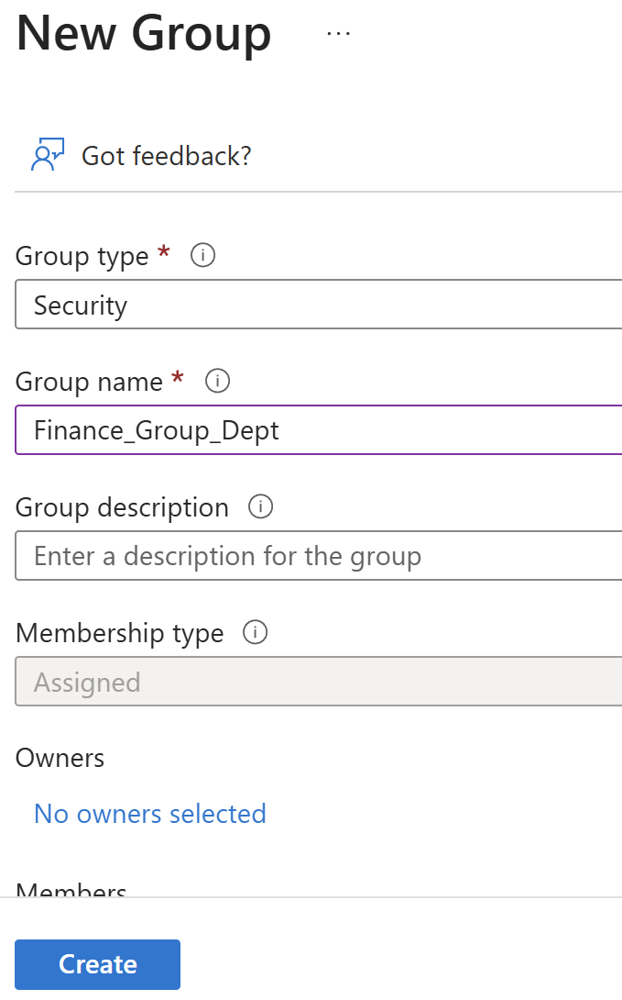
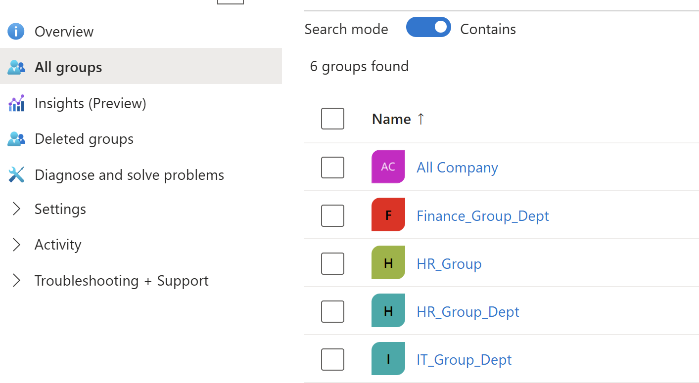
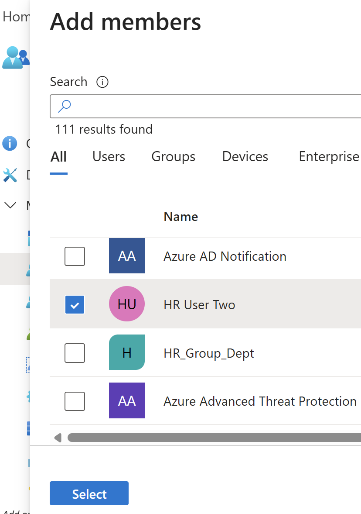
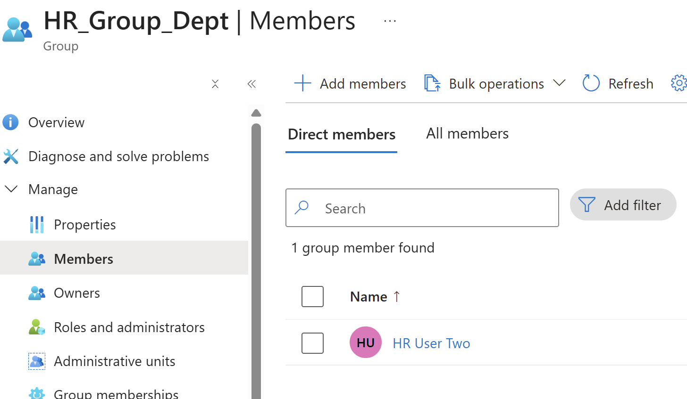
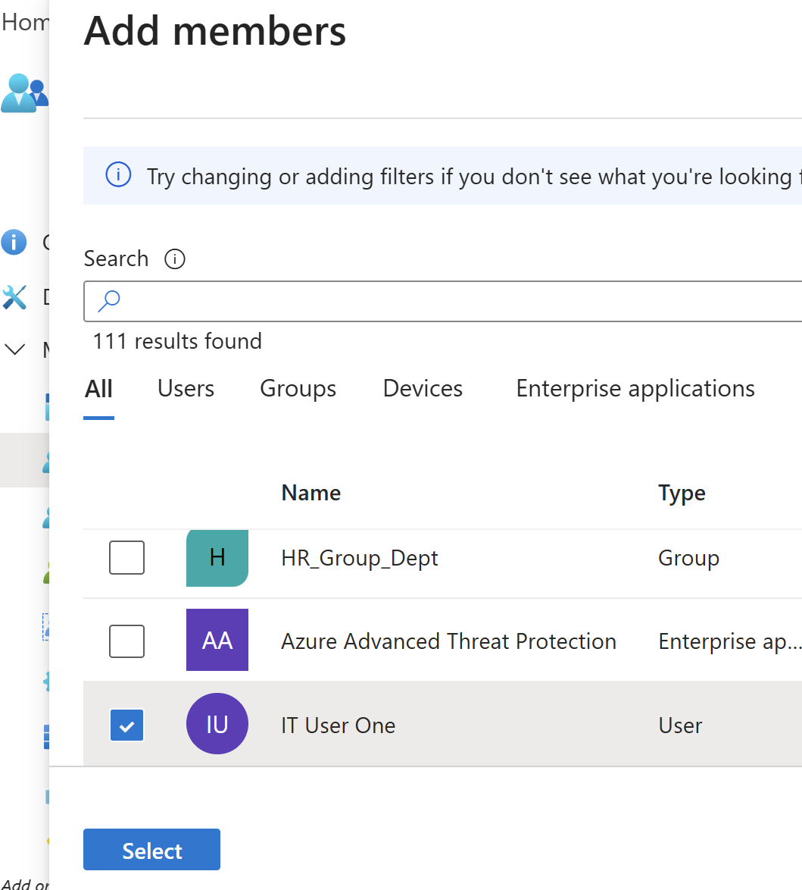
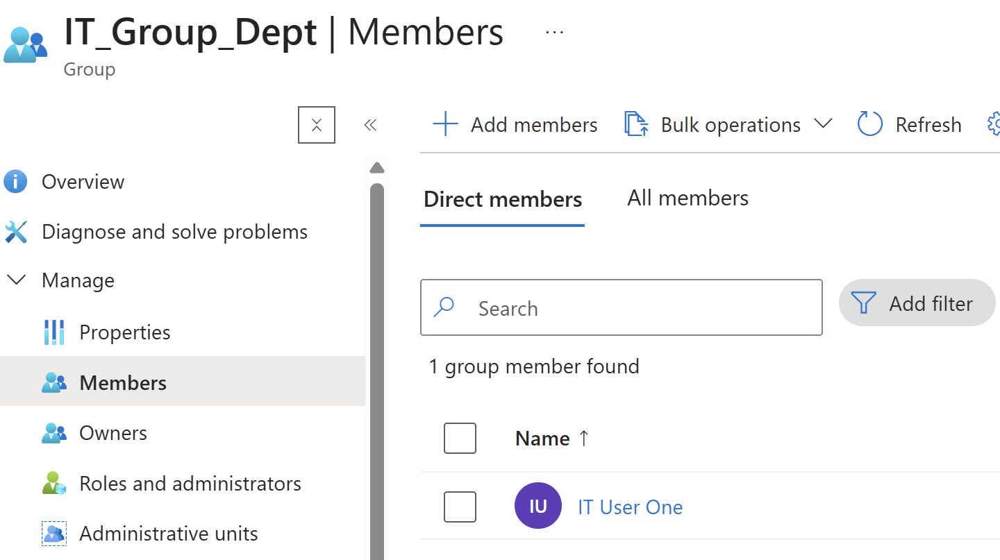
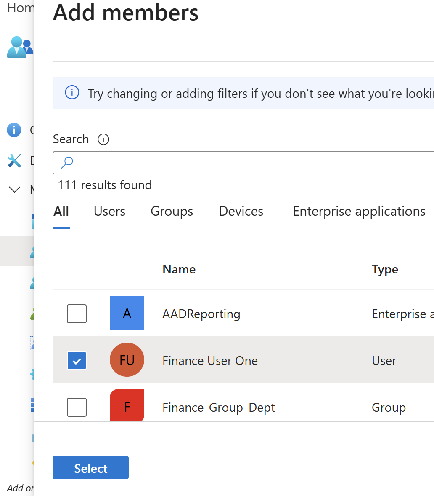
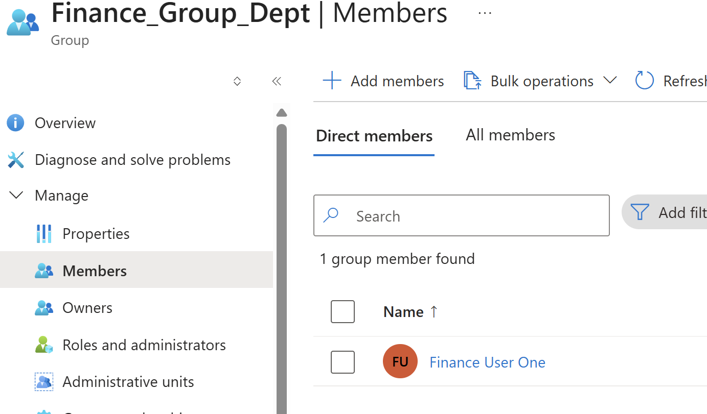

Department-Based Access Control Lab (Microsoft Entra ID)

## Objective
Simulate access control by organizing users into department-based groups.

## Implementation Details
- Created users for different departments (HR, IT, Finance)
- Created security groups for each department
- Assigned users to their respective department groups

## Skills Demonstrated
- Identity organization
- Group-based access control
- Access segmentation
- RBAC fundamentals

## Why It Matters
In real-world environments, users are grouped by department to simplify access control.  
This ensures users only have access to the resources they need, improving security and manageability.

## Screenshots

### IT User Added

### Add Finance User to Finance Group

### Finance User Added

