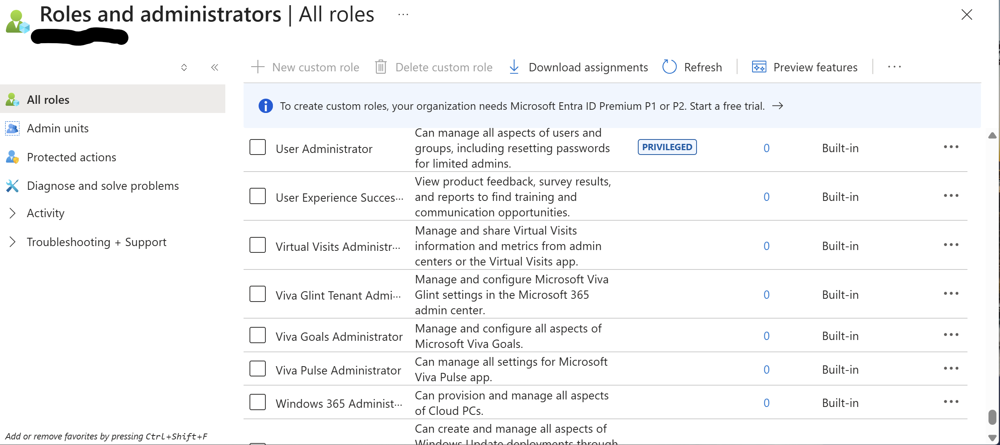
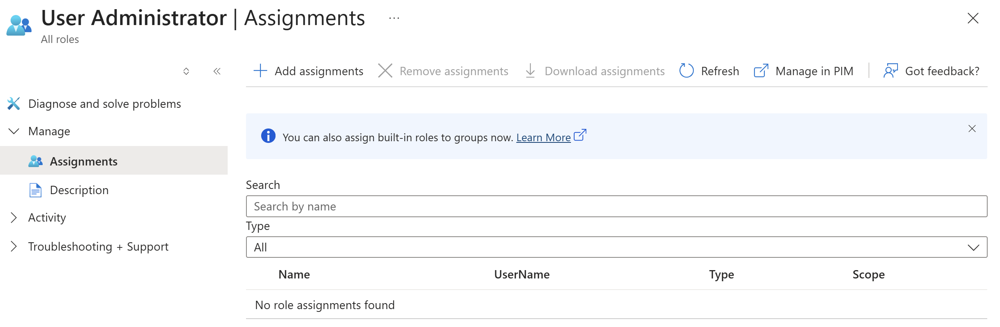
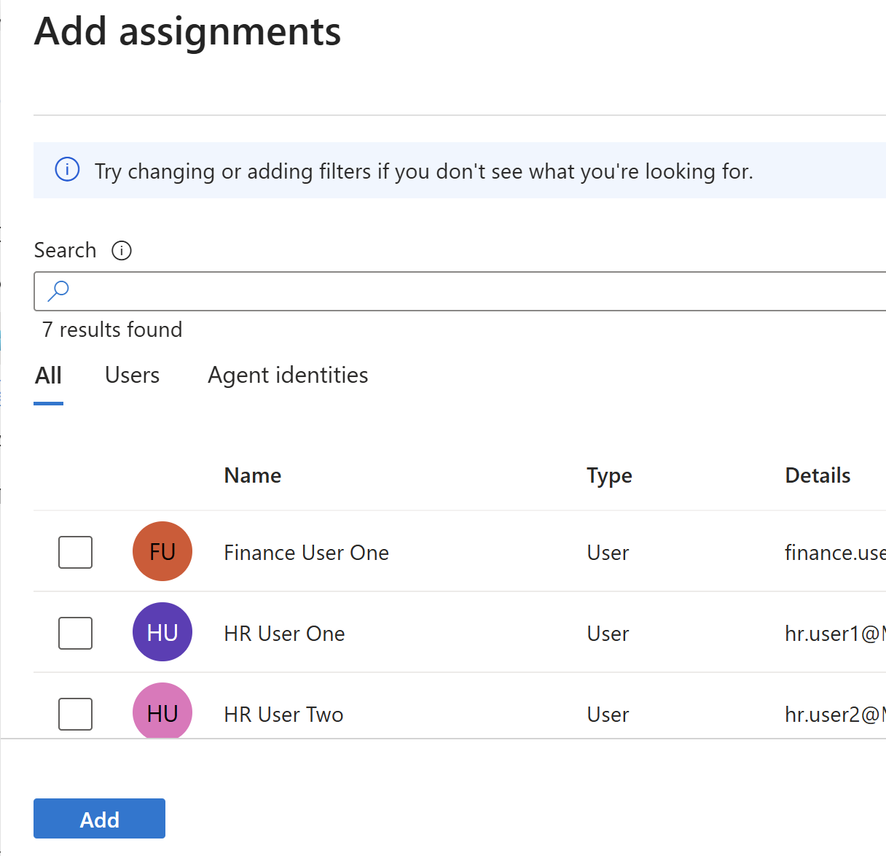
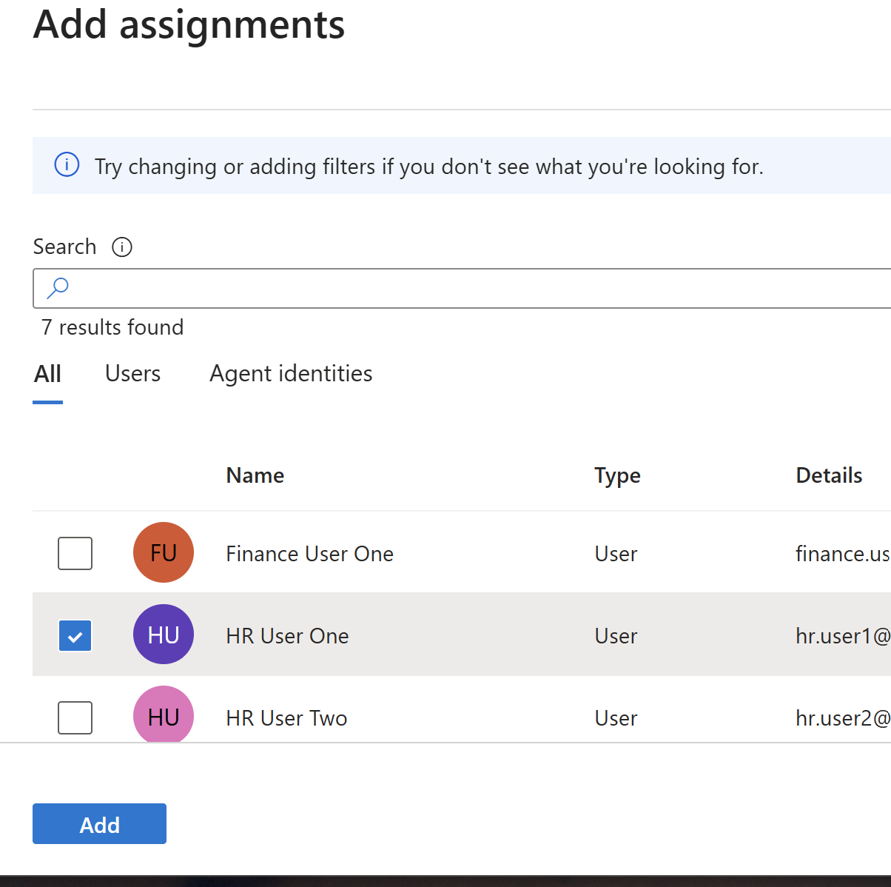
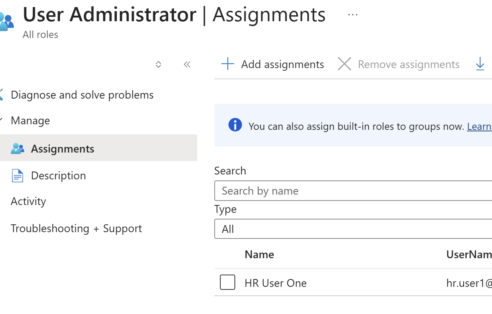

Role-Based Access Control Lab (Microsoft Entra ID)

## Objective
Simulate role-based access control by assigning built-in roles to users.

## Implementation Details
- Navigated to Roles and administrators
- Selected the User Administrator role
- Assigned the role to a user

## Skills Demonstrated
- RBAC (Role-Based Access Control)
- Privileged access assignment
- Identity and permission management

## Why It Matters
RBAC allows organizations to assign permissions based on roles instead of individual users.  
This improves security by enforcing least privilege and simplifies access management.

## Screenshots

### Roles Page

### User Administrator Role

### Add Assignment

### User Selected

### Role Assigned

