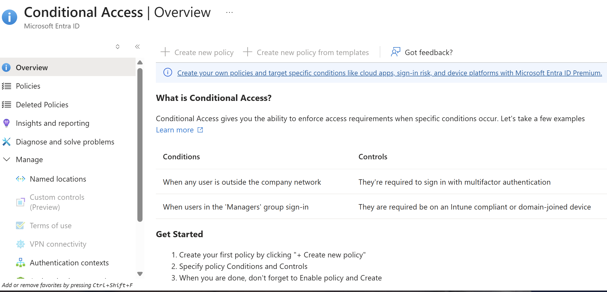
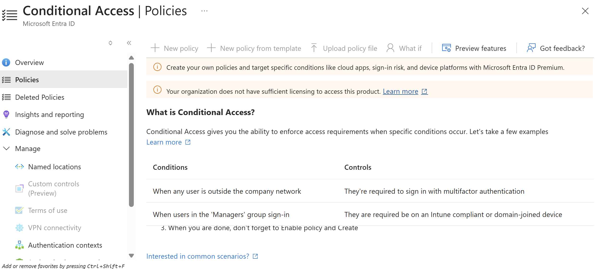
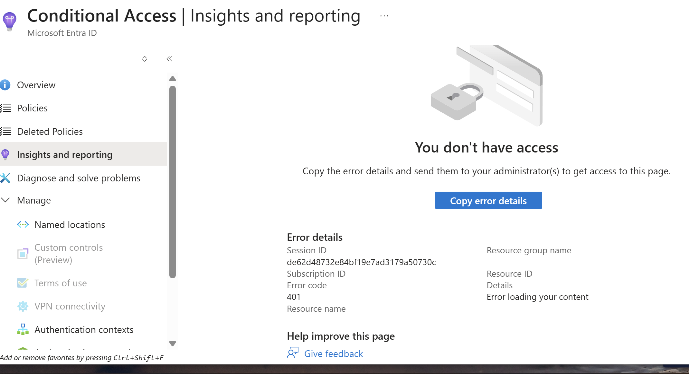
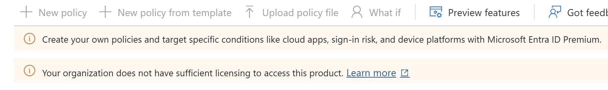

# Conditional Access Lab (Microsoft Entra ID)

## Objective
Understand how Conditional Access enforces access control decisions based on real-time conditions such as user identity, location, and device state.

---

## What is Conditional Access?

Conditional Access is a security feature in Microsoft Entra ID that evaluates login conditions before granting access to applications and data.

Instead of allowing access by default, Conditional Access checks signals such as:
- User identity
- Device compliance
- Location (trusted vs untrusted)
- Sign-in risk

Based on these signals, access can be:
- Allowed
- Blocked
- Allowed with additional requirements (such as Multi-Factor Authentication)

---

## What Problems Does It Solve?

Conditional Access helps protect organizations from:
- Unauthorized access attempts
- Stolen or compromised credentials
- Logins from unknown or risky locations
- Access from unmanaged or non-compliant devices

It supports a Zero Trust security model:
> Never trust, always verify.

---

## How Conditional Access is Used

In real-world environments, administrators create policies such as:
- Require MFA when users log in outside the corporate network
- Block access from specific countries or regions
- Require compliant or domain-joined devices
- Restrict access to sensitive applications

These policies ensure that access is granted only when defined security conditions are met.

---

## Implementation Notes

In this lab environment:
- Conditional Access was successfully located in Microsoft Entra ID
- Policy configuration options were explored
- The "Create new policy" option was unavailable

### Reason:
- Conditional Access requires Microsoft Entra ID Premium (P1 or P2)
- Administrative roles (e.g., Security Administrator) are required

This demonstrates real-world IAM constraints where:
- Security features are controlled by licensing
- Access is restricted based on role-based permissions (RBAC)

---

## Skills Demonstrated
- Identity and Access Management (IAM)
- Conditional Access fundamentals
- Security policy awareness
- Role-Based Access Control (RBAC)
- Zero Trust security concepts

---

## Why It Matters

Conditional Access is a core component of modern cloud security.

It allows organizations to:
- Enforce strong authentication policies
- Reduce the risk of account compromise
- Dynamically control access based on real-time conditions

Understanding Conditional Access is essential for:
- IAM Analyst roles
- SOC Analyst roles
- Cloud Security positions

---

## Screenshots

### Step 1: Conditional Access Overview

### Step 2: Policies Page

### Step 3: Insights and Reporting

### Step 4: Create Policy Disabled

### Step 5: Insufficient Permissions

