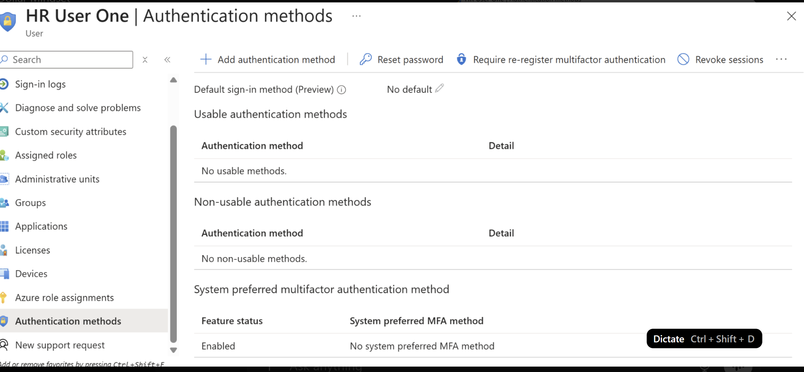
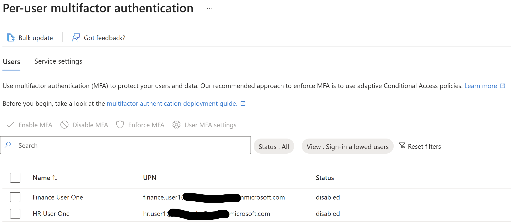
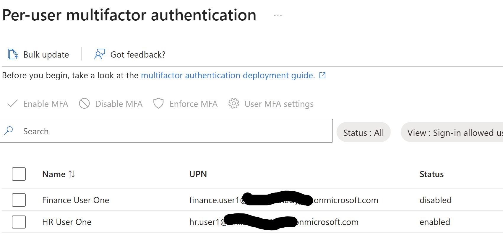
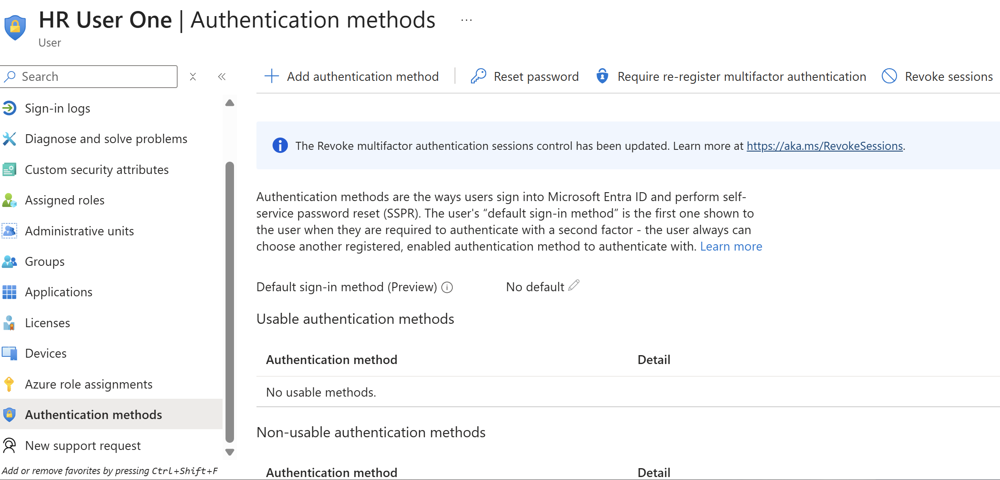

# Multi-Factor Authentication (MFA) Lab (Microsoft Entra ID)

## Objective

Configure and enforce Multi-Factor Authentication (MFA) for a user account to strengthen identity security and reduce the risk of unauthorized access.

---

## What is Multi-Factor Authentication?

Multi-Factor Authentication (MFA) is a security process that requires users to verify their identity using two or more authentication factors:

- Something you know (password)
- Something you have (phone, authenticator app)
- Something you are (biometrics)

MFA adds an extra layer of protection beyond just a password.

---

## What Problems Does It Solve?

MFA helps protect against:

- Stolen or weak passwords
- Credential stuffing attacks
- Phishing attacks
- Unauthorized account access

Even if a password is compromised, attackers cannot access the account without the second authentication factor.

---

## How MFA is Used

Administrators enable MFA to:

- Require additional verification during login
- Protect sensitive accounts and data
- Enforce stronger authentication policies
- Align with Zero Trust security principles

MFA can be enforced per user or through Conditional Access policies.

---

## Implementation Steps

1. Navigated to Microsoft Entra ID
2. Accessed **Per-user MFA settings**
3. Selected a user account (HR User One)
4. Enabled MFA for the user
5. Enforced MFA requirement
6. Verified authentication methods configuration

---

## Skills Demonstrated

- Identity and Access Management (IAM)
- Multi-Factor Authentication (MFA) configuration
- User security hardening
- Microsoft Entra ID administration
- Security best practices implementation

---

## Why It Matters

MFA is one of the most critical security controls in modern environments.

It significantly reduces the risk of account compromise and is required in:

- IAM Analyst roles
- SOC Analyst roles
- Cloud Security roles

---

## Screenshots

### Step 1: User Authentication Methods (Before)

---

### Step 2: MFA Disabled State

---

### Step 3: MFA Enabled

---

### Step 4: MFA Enforced

---

### Step 5: User Authentication Methods (After)

