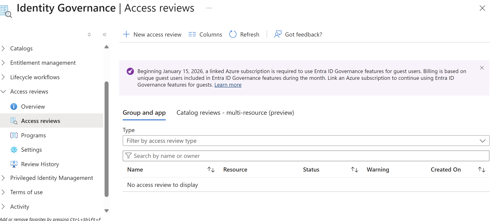
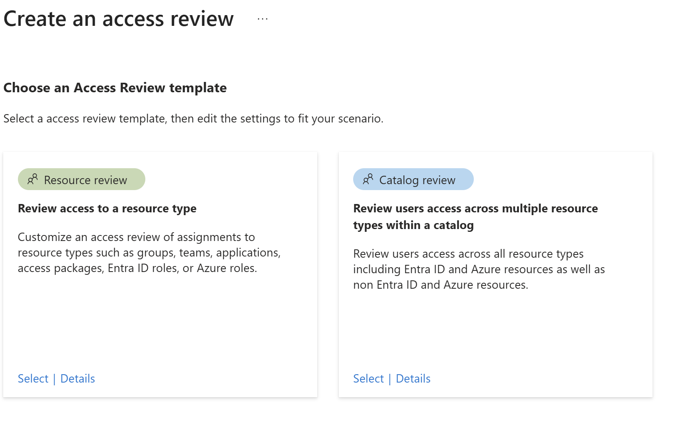
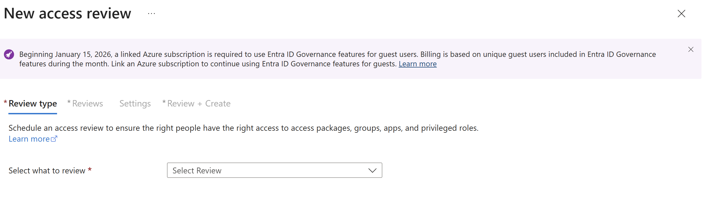

# Access Reviews Lab (Microsoft Entra ID)

## Objective

Understand how Access Reviews in Microsoft Entra ID help organizations regularly validate and manage user access to resources such as groups, applications and roles.

---

## What are Access Reviews?

Access Reviews are part of Microsoft Entra ID Identity Governance and are used to:

- Periodically review user access
- Ensure users still require assigned permissions
- Remove unnecessary or excessive access

They support security best practices by enforcing least privilege access over time.

---

## What Problems Does It Solve?

Access Reviews help prevent:

- Users retaining access after role changes
- Excessive permissions (privilege creep)
- Unauthorized access to sensitive systems
- Lack of visibility into who has access to what

This aligns with **Zero Trust principles**:

> Never trust, always verify.

---

## How Access Reviews are Used

In real-world environments, Access Reviews are used to:

- Review group membership (e.g., HR, Finance, IT groups)
- Audit application access
- Validate privileged role assignments
- Automatically remove users who no longer need access

Reviews can be configured to run:

- One-time
- Recurring (weekly, monthly, quarterly)

---

## Implementation Notes

In this lab environment:

- Identity Governance features were successfully located
- Access Reviews interface was explored
- The access review creation workflow was initiated
- Policy creation was partially accessible

Limitations observed:

- Full functionality requires **Microsoft Entra ID Premium P2**
- Some governance features require a linked Azure subscription
- Permissions and licensing restrict full configuration

This demonstrates real-world IAM constraints where:

- Governance features are license-dependent
- Administrative roles control access to security tools

---

## Skills Demonstrated

- Identity Governance fundamentals
- Access Reviews awareness
- Access control validation concepts
- Role-Based Access Control (RBAC)
- Zero Trust security principles

---

## Why It Matters

Access Reviews are critical for maintaining secure environments by:

- Continuously validating access rights
- Reducing risk of unauthorized access
- Enforcing least privilege access over time

They are widely used in:

- IAM Analyst roles
- Security Operations (SOC)
- Cloud Security positions

---

## Screenshots

### Step 1: Identity Governance Overview

### Step 2: Access Reviews Page

### Step 3: Create Access Review Workflow

### Step 4: License / Permission Message

