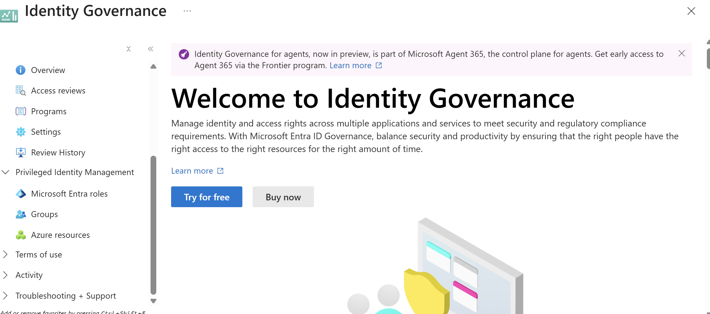
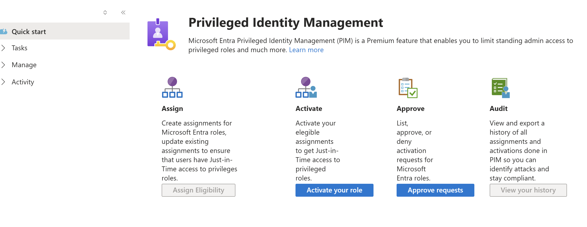
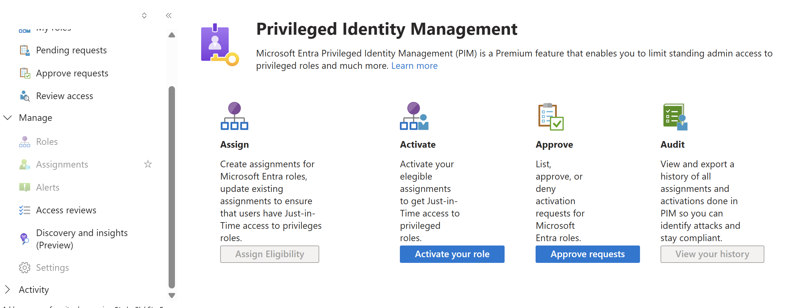
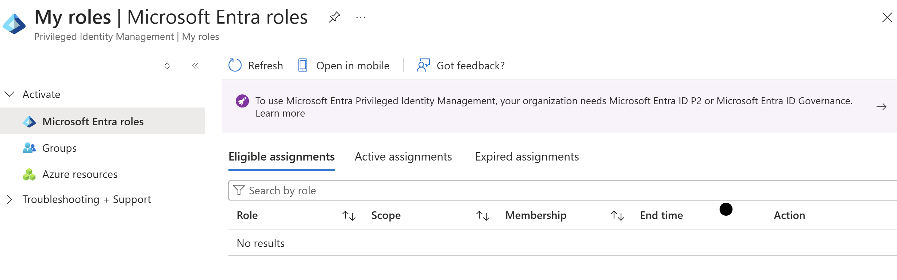

# Privileged Identity Management (PIM) Lab (Microsoft Entra ID)

## Objective

Understand how Privileged Identity Management (PIM) is used to manage, control, and monitor access to privileged roles in Microsoft Entra ID.

---

## What is Privileged Identity Management?

Privileged Identity Management (PIM) is a security feature in Microsoft Entra ID that allows organizations to manage privileged access to critical resources.

Instead of users having permanent administrative access, PIM enables:

- Just-in-time (JIT) role activation
- Time-bound access to privileged roles
- Approval-based role activation
- Monitoring and auditing of privileged access

---

## What Problems Does It Solve?

PIM helps protect organizations from:

- Excessive or permanent administrative privileges
- Insider threats
- Compromised admin accounts
- Lack of visibility into privileged access

It enforces **least privilege access** by ensuring users only have elevated permissions when needed.

---

## How PIM is Used

In real-world environments, PIM is used to:

- Require approval before activating admin roles
- Enforce Multi-Factor Authentication (MFA) for role activation
- Limit how long a user can hold elevated privileges
- Audit and monitor privileged activity

Example:

A user may be eligible for the **Global Administrator** role, but must:

1. Request activation
2. Complete MFA
3. Receive approval (if required)
4. Gain access for a limited time

---

## Implementation Notes

In this lab environment:

- Privileged Identity Management was located within Microsoft Entra ID
- Role management and assignment areas were explored
- PIM workflow and structure were reviewed

Limitations observed:

- Full PIM functionality requires **Microsoft Entra ID Premium P2**
- Some role activation and assignment features were restricted
- Licensing and permissions control access to privileged operations

This reflects real-world IAM environments where:

- Privileged access is tightly controlled
- Elevated permissions require additional security validation

---

## Skills Demonstrated

- Privileged Access Management (PAM)
- Identity and Access Management (IAM)
- Role-Based Access Control (RBAC)
- Just-in-Time (JIT) access concepts
- Zero Trust security principles

---

## Why It Matters

PIM is critical for securing administrative access in cloud environments.

It helps organizations:

- Reduce the attack surface
- Prevent privilege abuse
- Enforce strong access controls
- Maintain visibility into high-risk roles

PIM knowledge is highly valuable for:

- IAM Analyst roles
- SOC Analyst roles
- Cloud Security roles

---

## Screenshots

### Step 1: PIM Overview

### Step 2: Roles Page

### Step 3: Role Assignments

### Step 4: License / Permission Message

