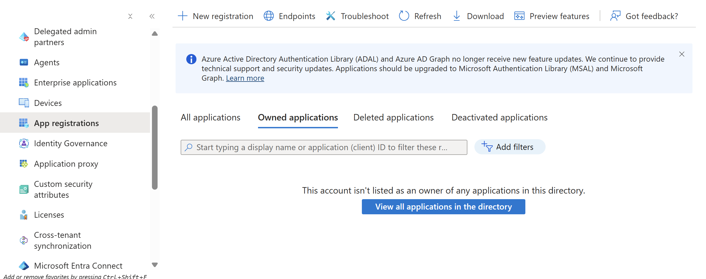
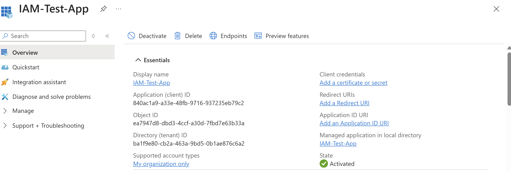
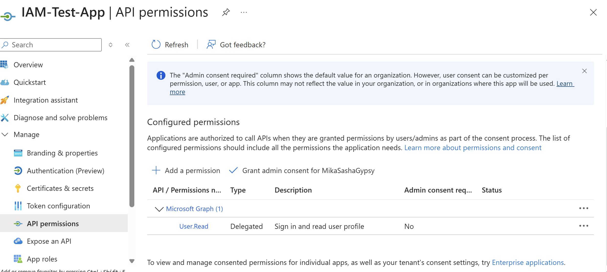
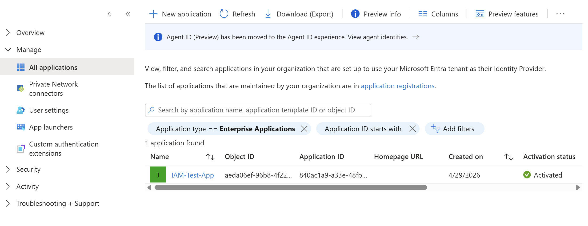
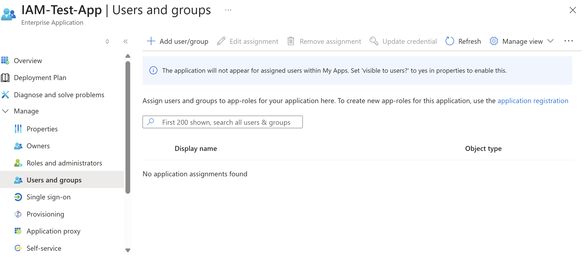

# Application Access Management Lab (Microsoft Entra ID)

## Objective

Understand how application access is managed in Microsoft Entra ID using App Registrations and Enterprise Applications.

---

## What is Application Access Management?

Application Access Management in Microsoft Entra ID controls how applications are registered, authenticated, and accessed by users.

It consists of two main components:

- **App Registration** – Defines the application identity in Entra ID
- **Enterprise Application** – Represents how the app is used within the organization

---

## What Problems Does It Solve?

Application access management helps organizations:

- Secure application authentication
- Control which users can access applications
- Manage permissions granted to applications
- Prevent unauthorized access to enterprise resources

---

## How Application Access is Used

In real-world environments, administrators:

- Register applications in Entra ID
- Configure authentication settings
- Assign users or groups to applications
- Manage API permissions and access levels

Example:

An internal application is registered, then access is granted only to specific departments such as HR or IT.

---

## Implementation Steps

1. Navigated to Microsoft Entra ID
2. Accessed App Registrations
3. Created a new application (IAM-Test-App)
4. Reviewed application overview and identifiers
5. Explored API permissions
6. Located the Enterprise Application
7. Accessed user assignment interface

---

## Skills Demonstrated

- Identity and Access Management (IAM)
- Application registration and management
- Access control configuration
- Enterprise application navigation
- Permission awareness

---

## Why It Matters

Application access management is critical for:

- Enabling secure Single Sign-On (SSO)
- Controlling access to business applications
- Managing identity-based authentication
- Supporting Zero Trust architecture

It is widely used in:

- IAM Analyst roles
- Cloud Security roles
- Enterprise IT environments

---

## Screenshots

### Step 1: App Registrations Page

---

### Step 2: Application Created (Overview)

---

### Step 3: API Permissions

---

### Step 4: Enterprise Application Overview

---

### Step 5: Assign Users and Groups

